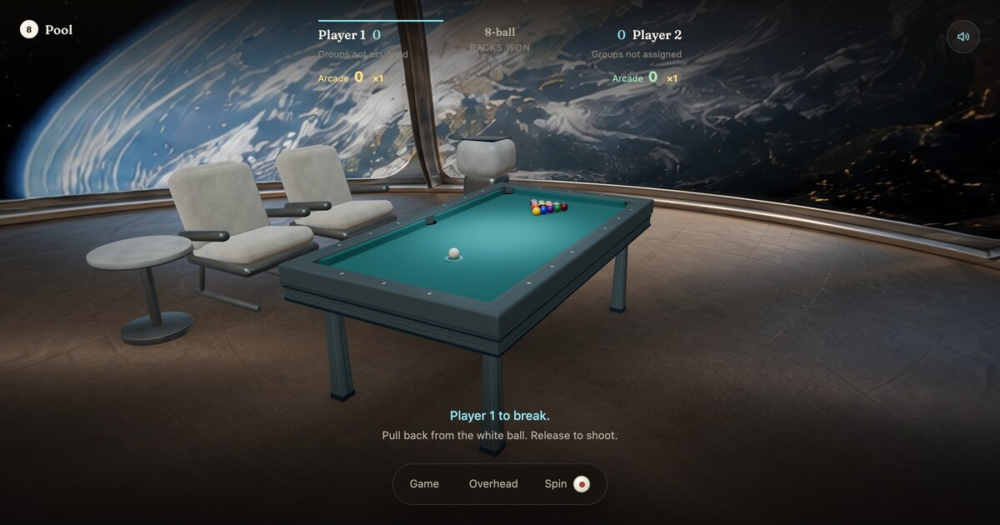

# Pool

A 7-foot pool table you can walk around, in the browser. Real physics, house-rules 8-ball,
three computer opponents, and private rooms you share with a link.

**[Play it at pool.darrinm.com](https://pool.darrinm.com)** — no install, no account, nothing to sign up for.



Built with [three.js](https://threejs.org) and [Rapier](https://rapier.rs), served from a Cloudflare Worker.

- **Physics, not animation.** Rapier steps the table at 480 Hz: a triangle-mesh felt with six real
  holes and pocket wells underneath so balls physically drop in, cushions with a real nose profile,
  rolling resistance and spin friction applied per step, and off-centre strikes with follow / draw /
  english. `physics/validate.mjs` checks 26 headless results against closed-form answers — the 90°
  and 30° rules, collision laws, cushion rebound, timestep sensitivity, tunnelling and determinism.
- **A computer that searches.** Hard copies the live physics world and tests pots, banks, legal
  escapes, power and spin, rejecting scratches and early 8s, then weighs the next shot or a defensive
  leave. It gets no aiming advantage — the same spin limits and 24 mph power cap a human has — and it
  runs in a worker, so the table stays responsive while it thinks.
- **Online rooms.** One SQLite-backed Durable Object per room. The server assigns seats, validates
  turn ownership and resolves the house rules; browsers simulate the shots. Casual friend matches: no
  accounts, no matchmaking, no rankings.
- **Nine rooms.** Generated photographic panoramas plus Blender-modelled furniture and matching
  reflection lighting, downloaded only when you choose one.
- **Sampled sound.** Ball-on-ball, cushion, cue tip, pocket drop and rattle; each hit picks a random
  take with strength-driven level, pitch and brightness, panned and attenuated from the camera.

Modes: **Local 8-ball** (two players, one device), **Vs Computer** (Easy / Medium / Hard),
**Play a Friend** (private link), and **Free Play** (no rules, plus Fling).

## Run it

```sh
npm install && npm run dev   # local / computer / free-play game
npm run dev:online           # adds the Cloudflare runtime, needed for online rooms
npm test                     # rules, computer, pointer behaviour, server protocol
npm run physics-test         # the 26-check physics harness
```

Node 24; `nvm use` picks it up from `.nvmrc`.

## Deployment
Live at [pool.darrinm.com](https://pool.darrinm.com).

GitHub Actions checks pull requests targeting `main`. Every push to `main` (including a merged PR)
runs the game-rule, AI, input and online-room tests, physics harness, and production build, then deploys to Cloudflare.
Failed checks prevent that workflow run from deploying. PRs never deploy. The workflow also supports
manual runs from the Actions tab on `main`; production deployments run one at a time.

The repository Actions secret `CLOUDFLARE_API_TOKEN` must contain a Cloudflare Workers deployment
token scoped to the account in `wrangler.jsonc` and the `darrinm.com` zone. Use Cloudflare's
“Edit Cloudflare Workers” token template. The account ID and custom domain are configured in
`wrangler.jsonc`.

For a manual local deployment, `nvm use` selects Node 24 (see `.nvmrc`), then `npm run deploy`
builds and publishes the local files, including uncommitted changes. Use your Wrangler login;
if the shell exports credentials for another account, run
`env -u CF_API_TOKEN -u CF_ACCOUNT_ID -u CLOUDFLARE_API_TOKEN -u CLOUDFLARE_ACCOUNT_ID npm run deploy`.

## Online rooms
Choose **Play a Friend**, then **Copy invite** and send the link to one friend. Both players must be connected
to start a shot. Each player controls only their own turn. Both must accept a rematch; the break alternates.
The same tab can refresh or reconnect without losing its seat. A shot interrupted by the shooter's disconnect
is rolled back to its starting table. An unfinished shot also times out after 90 seconds. Rooms expire after
24 hours without a game action. Choose a different game to leave a room.

`npm run dev:online` builds and serves the complete app with a local Cloudflare runtime at http://localhost:8787.
`npm run dev` serves the local / computer / Free Play game; online rooms require the Worker runtime.
`npm run build && npm run test:online` exercises a real local Worker and two WebSocket clients, including
turn enforcement, reconnect, interrupted shots, ball-in-hand, and mutual rematches. CI runs it before deployment.

Each private room has a SQLite-backed Durable Object. The server assigns seats, validates inputs and turn
ownership, resolves the shared house rules, and persists the accepted table. Browsers simulate shots; the
shooting browser reports collisions and final positions, which the server checks structurally and shares with
both players. These are casual friend matches: the server does not independently simulate physics or provide
competitive anti-cheat. There are no accounts, public matchmaking, or rankings.

## Environments
Choose **Room** in the desktop dock, or **Game → Room** on compact screens and after play starts.
**Orbital Lounge** is the default for new players. A saved room choice takes precedence.
**Minimal** remains available with the original green cloth, walnut table, dark room, and table sounds only.
The eight optional rooms—The Corner Pocket, Desert Modern, Tokyo Rooftop, Orbital Lounge, Alpine Lodge,
The Glasshouse, Amalfi Terrace, and Atlas Courtyard—each have their own cloth,
rail finishes, architecture, scenery, lighting, and textured furnishings. Select a card to preview;
**Play here** saves your choice on this device. Closing or pressing Escape restores the previous room.
Changing rooms preserves the rack, turn, custom camera, and physics; online players choose their own scenery.
Optional rooms get a wider composition from the original desktop starting view; portrait and short windows keep the overhead view.
Every room is quiet between shots. **Sound** / **M** controls only the pool effects, which mute while the page is hidden.
The optional rooms use generated photographic panoramas projected onto a floor and surrounding dome, plus
Blender-modeled furniture and matching reflection lighting. Artwork and models load only when needed; the current
room remains playable during loading. Failed or cancelled downloads keep the existing room, and switching releases
the old room's graphics resources. Minimal requires no room downloads.

Art prompts, editable Blender files, and the reproducible asset builder live in
[`pipeline/environments`](pipeline/environments/README.md). Runtime WebP and GLB files are in `public/environments`.

## Shot replay

**Replay** in the table controls, or **V**, plays the last completed shot in Local 8-ball, Vs Computer,
Play a Friend, and Free Play Cue / Fling. Pause, scrub the timeline, restart, or choose ¼×, ½×, 1×, or 2×
speed. Camera orbit and zoom remain available. **Back to game** or **Escape** restores the live view.
Replay is available with Arcade on or off and does not change scores, turns, or ball positions.

The replay records actual ball poses and pocket disappearances instead of resimulating the shot. Local
physics and the computer's turn pause during playback and resume on return. Online replay is private to
your device, becomes available only after the server accepts the shot, and automatically exits when the
table updates. Rejected or rolled-back shots do not replace the last accepted replay. Replays are kept in
memory until the next completed shot or a game-mode change; long Free Play recordings lower their sample
rate to keep memory bounded. Additional flings before the table settles belong to the same replay.

## Arcade

**Game → Arcade** adds Playful effects and a separate arcade score to local matches, every computer difficulty,
online rooms, and Free Play Cue / Fling. Warm bursts and points rise from the pocket that received the ball;
contacts pop, rails ripple, scratches gulp, early 8s get “TOO SOON!”, and fresh racks get a brief flourish.
Arcade is on by default; the switch remembers your preference, including turning it off. **Reduced effects** keeps local scores readable with calmer motion;
the system's reduced-motion preference supplies its initial setting. Sound / M also mutes arcade accents.

While Hard studies the table, faint chalk paths and a ghost cue ball show samples from its ongoing practice shots.
At most two candidates appear, with a local target/pocket highlight and a small “Hmm…” bubble. New candidates
replace old ones immediately. The chosen shot gets a quick “Aha!” during the normal 180 ms cue windup;
all thinking effects clear before the strike. Planning starts as soon as the table settles and never waits for
an effect to finish. Easy and Medium go straight to their chosen shot. Reduced effects use static highlights.
The settled physics world is held during planning and cue windup so the shot starts from the exact state the
computer evaluated. Rendering continues throughout; spin, friction, and collision processing resume with the strike.

Eligible pots earn 100 points, banks add 150 (plus 75 for each of two additional rails), kicks and combinations
add 200, and additional pots in one play add 200 / 300 / 400… A legal winning 8 adds 500. Consecutive scoring
plays use ×1, ×1.5, ×2, then ×3. Points stay pending until the shot settles; fouls and losing shots void that
play's points and reset its streak, while earlier points remain. The break 8 is still respotted, and the 8 is
an ordinary ball in Free Play. Racks won, turns, physics, and computer strategy retain their normal rules.

The ledger tracks the rack even with Arcade hidden; toggling it never changes scoring. Each online player
chooses their own effects while the server shares the accepted points. Reconnecting restores totals without
replaying celebrations. Scores reset with each fresh rack, and personal bests are saved on this device per
game mode and computer difficulty. Switching input or difficulty during play makes the rack mixed practice.
Fling awards come from actual releases and their collision chains; holding or manually pushing balls cannot
earn points. Multiple releases before the balls settle count as one play.

The [Arcade plan](docs/arcade-mode-plan.md) contains the full design. `src/arcade-events.js` records bounded
contact evidence; `src/arcade-score.js` supplies the pure scorer shared with the server; `src/arcade.js`
connects the game, HUD, and effects. Long-pot and thin-cut awards remain a planned follow-on.

## Playing
Choose **Local 8-ball** to play a match with another person on this device, or **Free Play** for Cue / Fling.
Local matches track turns, remaining solids / stripes, fouls, rack wins, and rematches with alternating breaks.
The score is labeled **Racks won**. Player cards show **Groups not assigned** until a group is claimed,
then a remaining-ball count and colored ball markers. **Last shot** explains pocketed balls, group assignment,
fouls, and rack results; it stays visible through the next player's turn and online reconnects. Computer and
online messages use **You**, **Computer**, and **Friend** consistently with the player cards.
After a foul, click clear felt or drag the cue ball to place it. Choose a pocket before shooting the 8; the selected
pocket glows gold on the table. **Overhead** gives a top-down view.

When it is your turn on the 8-ball, **Call the 8-ball pocket** appears above the table controls.
Your chosen pocket stays marked on the table and named in the guidance. **Change pocket** lets you
revise the call until you take the shot; the shot uses that final choice.

Re-racking gathers the balls from their current table positions. Missing balls return at random clear
spots first, then all sixteen balls glide into the rack and cue-ball position. Shooting resumes after
the brief setup animation; it creates no shots or arcade points. Reduced motion places the rack immediately.

Pool uses house rules: the table stays open after the break; the first legal shot pocketing only one group assigns
solids / stripes. Hit your own group first, then pocket a ball or drive a ball to a cushion. All fouls give ball-in-hand
anywhere. The 8 must be played on a separate shot after clearing your group, into the called pocket. An early 8,
foul with the 8, or wrong pocket loses. The 8 is spotted after a break; a dry break needs four distinct object balls
to a cushion, otherwise the incoming player breaks a fresh rack. Regular shots need no call. These simplified break
and call-shot rules are intentional; this is not a tournament rules implementation.

**Vs Computer** adds Easy / Medium / Hard opponents. You are Player 1; the computer is Player 2.
Easy favors sensible, simple pots with forgiving aim and loose power control; it should make short shots but rarely sustain a long run. Medium offers more precise aim and power, with geometric shot selection that can build runs but does not plan ahead. Both become less accurate on long or thin cuts. Hard is the default and searches a copy of the live Rapier world: it tests pots, banks, legal escapes, power and spin, rejects scratches and early 8s, and considers the next shot or a defensive leave. It also searches legal ball-in-hand placements and calls the 8. Hard adds no random aiming error; every shot still uses the same physics, spin limits and 24 mph power limit as a human. Its background worker keeps rendering and camera controls responsive while it thinks, and is canceled on a reset or mode/difficulty change.

`npm test` checks rules, computer shot selection and actual potting power, Hard scratch/safety/run-out regressions, pointer behavior, and the server protocol. `npm run benchmark:computer` compares Easy, Medium and Hard on eight reproducible, shared endgame layouts, measuring run-outs, pots and fouls (four seeded visits per layout for the randomized levels, one for deterministic Hard); it is a diagnostic benchmark, not a human win-rate estimate. The pure rules engine lives in `src/eight-ball.js`.

On phones, tablets, and short windows, a compact action bar keeps settings off the table. **Game** opens mode, difficulty, appearance, sound, and help; **Room** also contains the invite and reconnect controls during online play. **Spin** opens a larger contact-point control, and **Call pocket** appears when you reach the 8. Drag empty space to orbit and use two fingers to pan or pinch to zoom. While holding a shot or placement, tap **Cancel** with another finger to abandon it.

Portrait screens start overhead with the table running lengthwise and fitted between the score and controls.
Short landscape screens put the controls beside the table. Overhead remains available after the first shot on
desktop, along with a visible Cancel button while aiming. The cue ball has a forgiving grab area (larger for
touch); grabbing slightly beside it preserves the direction of the drag and never steals a direct hit on another ball.

Press `Esc` while lining up a cue shot to cancel without shooting.
Drag back from the cue ball to shoot; the further the pull, the harder the hit (up to 24 mph / 10.7 m/s). The ball
widget (bottom right) sets follow / draw / english; Reset centers the contact point. Left-drag the table to orbit, right-drag to pan, wheel to zoom,
`C` resets the view. Numbered **Balls** are the default. Heads / Balls buttons (or `B`) swap the heads for authentic numbered balls. `M` mutes,
`R` re-racks. The desktop setup dock groups play mode, ball appearance, reset view, and re-rack. It hides after the first shot or fling and stays tucked away between racks; the small **Game** button reopens these settings.
The header shows pocketed balls and shots, with sound and a Help menu for controls and shortcuts.

Choose **Fling** (or press `F`) to grab any ball and slide it across the felt. Release while moving to
fling it in the direction of your mouse; move faster for a harder throw. Hold still before releasing to place
the ball. Balls still collide with each other and the cushions. Drag empty table space to orbit as usual,
and choose **Cue** or press `F` again to return to cue shots.

## Layout
- `src/hard-computer.js` – physics-based Hard search; `src/shot-simulation.js` – isolated shot evaluation; `src/computer-worker.js` – background execution.
- `src/eight-ball.js` – shared house rules; `src/computer.js` – computer shot planning; `src/online.js` – invite rooms and reconnects.
- `server/worker.js` – private Durable Object rooms; `server/protocol.js` – validated server actions and shot results.
- `src/main.js` – fixed-step loop (480 Hz physics, interpolated rendering), key routing, `window.playful` debug handle.
- `src/pointer-input.js` – browser pointer routing, including release before or after capture loss. `src/fling.js`
  estimates throw velocity from recent mouse samples. `node --test physics/*.test.mjs` checks both modules.
- `src/core.js` – renderer, camera, physics world, the 14 heads, and the prop registry and pointer helpers the scene uses.
- `src/pool.js` – the game. Physics: gravity into the felt, a triangle-mesh felt with six real holes and pocket wells
  underneath so balls physically drop in (rail-side castings lean over the hole and catch a fast ball), cushions with a
  real nose profile, ball/cushion/felt friction and restitution via combine rules, rolling resistance and spin friction
  per step, off-centre strikes, and an aim guide (shape cast to the first impact, ghost ball, object-ball line) with a
  cue stick that pulls back and elevates over the rail. Presentation: procedural felt / wood / carpet textures
  (`src/textures.js`), clearcoat heads, an overhead panel light plus a shadow-casting spotlight (the fixture fades out
  as the camera climbs to it), room environment reflections, ACES tone mapping, fog, contact shadows.
  The cue ball is always plain white and the 8 is a plain black ball at the centre of the rack; the 14 heads take the
  other numbers, with a standard numbered cap baked into the bottom of each texture (`src/ballcaps.js`). Heads rack
  face-up and upright as seen from the cue ball; balls rack number-up. Scale: 1 unit = 26 mm, g = 377.
- `src/sounds.js` – sampled impact sounds: ball-on-ball (soft and hard takes), cushion, cue tip, pocket drop and rattle;
  each hit picks a random take with strength-driven level, pitch and brightness; stereo panning and distance attenuation
  from the camera; a short synthetic room reverb. No rolling bed (a ball on cloth is near silent). The earlier modal
  synthesis is kept behind `mode = 'synth'`; `audition.html` (served by the dev server) plays the two side by side per
  event with a blind A/B and score.
- `physics/poolphysics.js` – the table physics as a plain module (constants, felt / cushion / pocket-well / backstop
  colliders, strike, rolling resistance, spin friction) shared by the scene and the harness.
- `physics/validate.mjs` – 26 headless checks: closed-form sliding / rolling results, collision laws, the 90° and 30°
  rules, cushion rebound, engine hygiene (timestep sensitivity, tunnelling, determinism), and a pocket sweep including 24 mph shots.
  `RATE=120 npm run physics-test` shows the coarse-step losses that led to stepping at 480 Hz. Known deviation: heavy
  topspin into a rail rebounds livelier than on a real table.
- `public/heads/` – the optional equirectangular head maps, kept out of this repository
  (see [Head textures](#head-textures)). Absent, the head balls fall back to plain colours and the
  game is unaffected; numbered balls are the default appearance either way.
- `public/sfx/` – the sound samples plus `manifest.json`.
- `pipeline/` – sound-effect generation (Python; `python3 -m venv .venv && .venv/bin/pip install -r pipeline/requirements.txt`):
  `sfx.py` generates takes per event with ElevenLabs Sound Effects v2 on fal (`FAL_API_KEY` from the environment);
  `sfx_analyze.py` measures onset, attack, ring time and spectral centroid, strips the generator's edge clicks, rejects
  quiet and double-hit takes, trims, normalises and writes `public/sfx/` with the manifest (`--write`).
- `tasks/` – plan and lessons.

## Head textures

The head balls can be textured with photographs of real people. Those images are not in this
repository and are not redistributable, so a checkout has no `public/heads/`. Nothing is missing:
numbered balls are the default appearance, and the head balls fall back to plain colours when the
files are absent.

The canonical copy lives in a store outside the repository, so no git operation inside it can put
them back into history. `$POOL_HEADS_DIR` overrides the default location (`~/.pool-heads`).

```sh
npm run heads:status    # what is in the store and in the working tree
npm run heads:stash     # working tree -> store, first-time setup
npm run heads:restore   # store -> working tree, before a private build
npm run heads:clear     # remove them from the working tree
```

A restored working tree builds and deploys exactly like any other, because Vite copies `public/`
into `dist/` either way. `heads:clear` refuses to run while the store is empty, so it cannot destroy
the only copy.

**Deploying with them.** `npm run deploy:private` restores the textures and deploys to the separate
Worker in `wrangler.private.jsonc` — its own hostname and its own Durable Object namespace, so the
public site never receives them. That hostname is unlisted, not protected; put Cloudflare Access in
front of it if the textures should not be reachable by anyone who guesses the name.

The public `npm run deploy` runs `heads:guard` first and refuses to build while any texture is in
the working tree, which is what stops a deploy right after a private one from publishing them. CI
runs the same guard before deploying to pool.darrinm.com.

**Before making this repository public**, run `npm run check:publishable`. Untracking the textures
does not remove them from earlier commits, and a public repository publishes its whole history. The
check fails until the blobs are unreachable from every ref, and prints the `git filter-repo` recipe.

## License

Code is [MIT](LICENSE).

The art and audio assets are **not** covered by that grant, and are included only so the
game runs from a checkout:

- `public/environments/` — generated panoramas and Blender-modelled furniture.
- `public/sfx/` — sound takes generated with ElevenLabs Sound Effects; their reuse follows
  ElevenLabs' terms, not this repository's.
- `public/heads/` — optional head textures of real, identifiable people. All rights reserved:
  they are not licensed for redistribution, modification, or any use beyond running this game.
  The game does not need them — numbered balls are the default, and if the files are absent the
  head balls fall back to plain colours.

Third-party runtime dependencies keep their own licenses — [three.js](https://github.com/mrdoob/three.js)
(MIT), [Rapier](https://github.com/dimforge/rapier) (Apache-2.0), and the
[Fraunces](https://github.com/undercasetype/Fraunces) typeface (SIL OFL 1.1).
