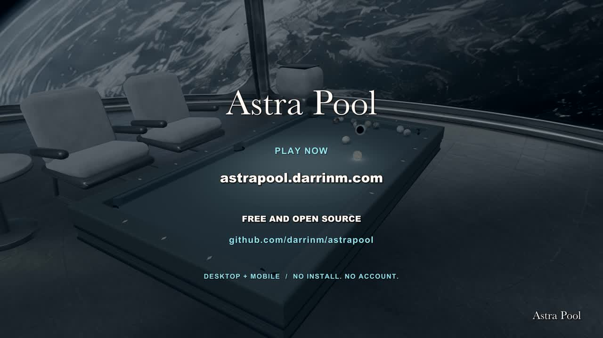

# Astra Pool — Your Shot

The final action trailer is **49 seconds, 1920×1080, 30 fps**, with stereo AAC sound and H.264 video. It includes quick cuts, macro and tracking cameras, the Tricky computer's actual search paths and scoring shots, portrait and landscape mobile play, and Black Hole Gravity. The final cards introduce the play modes and link to the free, open-source game. The game’s cue stick appears during setup and follow-through, and an Astra Pool wordmark stays in the lower-right corner from the first frame to the last.

[](astra-pool-trailer.mp4?raw=true)

[Download the final trailer](astra-pool-trailer.mp4?raw=true) · [Download the clean footage](astra-pool-footage.mp4?raw=true)

## What's included

| File | Purpose |
| --- | --- |
| `astra-pool-trailer.mp4` | Approved final trailer, including titles and music |
| `astra-pool-footage.mp4` | Silent footage master for editing without launching the game |
| `poster.jpg` | Preview of the final closing card |
| `action/capture-manifest.json` | The final edit timeline, computer searches, shot receipts, and synchronized sound events |
| `action/compose.py` | Editable titles, original synthesized score, sound mix, color grade, and MP4 export |
| `action/capture.js` | Shot order, camera moves, slow motion, and phone compositions |
| `action/breaks.js` | Seven distinct break recipes: cue placement, contact point, power, spin, and rack order |
| `action/engine.js` | Frame-by-frame rendering, physics, responsive HUD capture, and sound logging |
| `action/search-worker.js` | Runs the actual Tricky algorithm against the live table snapshot |
| `action/prepare.mjs` | Generates capture pages, layouts, and a capture-only pool module from the game source |
| `action/server.mjs` | Receives rendered frames on localhost |

The footage master retains in-game search bubbles, scoring effects, phone frames, and mobile promotional copy. Large trailer titles, the end card, soundtrack, and color grade are applied by the composer. Camera or phone-layout changes require a new capture. Earlier trailer drafts and intermediate frames are not included.

## Edit titles, music, or the mix

Use Python 3.12 or newer and FFmpeg with `libx264`, AAC, and `libass`. On macOS, the export uses Arial, Arial Black, and Baskerville installed with the OS; font files are not distributed here.

From the repository root:

```sh
python3 -m venv .venv
.venv/bin/python -m pip install -r pipeline/trailer/action/requirements.txt
.venv/bin/python pipeline/trailer/action/compose.py
```

The default command reads the committed footage and matching manifest, synthesizes the score and pool sounds, and writes **`pipeline/trailer/action/render/astra-pool-trailer.mp4`**. It leaves the approved trailer intact. Change the `title(...)` calls and audio sections in `compose.py` to edit the film. Intermediate WAV and ASS subtitle files (including the persistent corner wordmark in `brand.ass`) are also written to `action/render/` for use in other editors.

For a different output location:

```sh
.venv/bin/python pipeline/trailer/action/compose.py --output /tmp/astrapool-edit.mp4
```

On Linux or another platform, install equivalent fonts and select their family names. For example, with DejaVu fonts installed:

```sh
.venv/bin/python pipeline/trailer/action/compose.py \
  --sans-font 'DejaVu Sans' \
  --display-font 'DejaVu Sans' \
  --serif-font 'DejaVu Serif'
```

Font substitutions change the typography. Rebuilding from the compressed master may also introduce a small additional generation of video compression; the committed final MP4 is the reference export.

## Change cameras or capture new gameplay

Use the Node version in `.nvmrc` (Node 24) and a desktop Chromium browser with WebGL, Web Workers, and canvas export support. Keep the capture tab active and the window visible while rendering: the game suppresses some effects when the document is hidden.

From the repository root:

```sh
npm ci
node pipeline/trailer/action/prepare.mjs
npm run dev -- --host 127.0.0.1 --port 5173 --strictPort
```

In a second terminal:

```sh
node pipeline/trailer/action/server.mjs
```

Open **http://127.0.0.1:5173/pipeline/trailer/action/capture.html** and click **Render trailer footage**. Wait for the completion message (1,470 frames / 49 seconds). The receiver binds only to `127.0.0.1:5174`; both ports must be available. Close the capture tab and stop both terminal processes when finished.

Compose the fresh frames with their matching sound data:

```sh
.venv/bin/python pipeline/trailer/action/compose.py \
  --frames pipeline/trailer/action/render/frames \
  --manifest pipeline/trailer/action/render/capture.json
```

To save another silent footage master for future editing:

```sh
ffmpeg -framerate 30 -i pipeline/trailer/action/render/frames/%05d.jpg \
  -frames:v 1470 -c:v libx264 -preset slow -crf 16 -pix_fmt yuv420p \
  -movflags +faststart -an pipeline/trailer/action/render/footage.mp4
```

Generated pages, the temporary pool module, JPEG frames, and render outputs are ignored by Git. The receiver overwrites frames in that render directory during a capture; keep a copy elsewhere before making an alternate take. Allow roughly 1 GB of free disk space for a full capture and export.

`prepare.mjs` derives the HTML from `index.html` and adds snapshot and cue-pose hooks to a temporary copy of `src/pool.js`. It does not edit production source or add capture tools/media to the site's Vite build. Re-run preparation after game changes.

The capture code contains all camera and timing choices. Each break uses its own repeatable recipe in `breaks.js`; the opening, two mobile views, three room cuts, and finale have different starting positions and shot directions. The rack keeps the 8 ball centered and a solid/stripe in the rear corners. The manifest records each break’s initial positions and positions at 0.25 and 0.5 simulated seconds for checking that the resulting ball paths differ. `stroke` / `strokeStart` animate a windup within a cut, while `film.shoot(plan, windupSeconds)` can delay the strike for a short setup. Cue poses reuse the game’s geometry and rail-clearance calculation; follow-through stays anchored at the original strike point and disappears after 0.24 simulated seconds. The corner wordmark is applied after the picture fades so it remains visible throughout.

If you change section lengths, update the title times, music transitions, and end-card timing in `compose.py` too. An optional `?retake=bank` capture-page query replaces frames 210–479 and the corresponding metadata after a full capture; it assumes the original 49-second timeline.

## Capture provenance

This revised footage was produced from game revision `3b48ee7` (PR #20), with the cue choreography and persistent corner branding added in the trailer tools. Shots are staged in Free Play using the game's renderer and physics. The computer candidates and selected shots come from the real Tricky search on the live table; the search previews are replayed at an editorial cadence. The recorded live receipts include a bank worth 250 points, a combination/double kiss worth 750, and a kick/bank worth 525. This is cinematic footage, not a recording of a competitive multiplayer match.

Mobile footage uses actual 390×844 and 844×390 iframe viewports at 2× pixel density. The responsive HUD is rasterized from its DOM and computed CSS before the phone frame is added.

A fresh capture uses the current game and runs new computer searches. Physics or renderer revisions, fonts, viewport dimensions, and particle randomness can change its appearance and selected shots; use the committed footage and manifest to preserve the approved action while editing titles and audio. The capture page also uses the game's browser storage for presentation settings and Free Play scores; a separate browser profile keeps those separate from normal play.

The electronic score is generated by `compose.py`. Pool impact samples come from `public/sfx`; visuals use the repository's existing game assets and their existing attribution/licensing. No external music, voiceover, or private head textures are included. The tooling and final trailer are distributed under the repository's MIT license; OS font files are not bundled.
